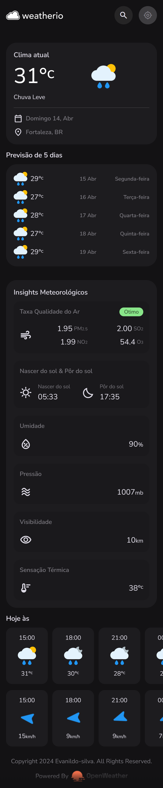
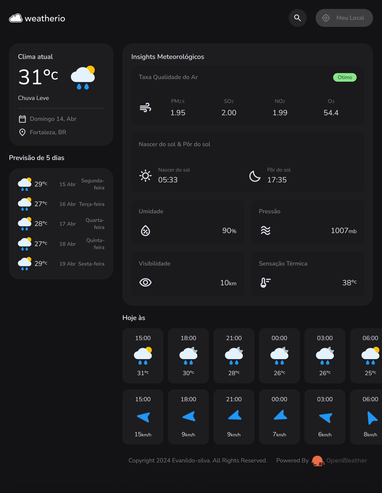
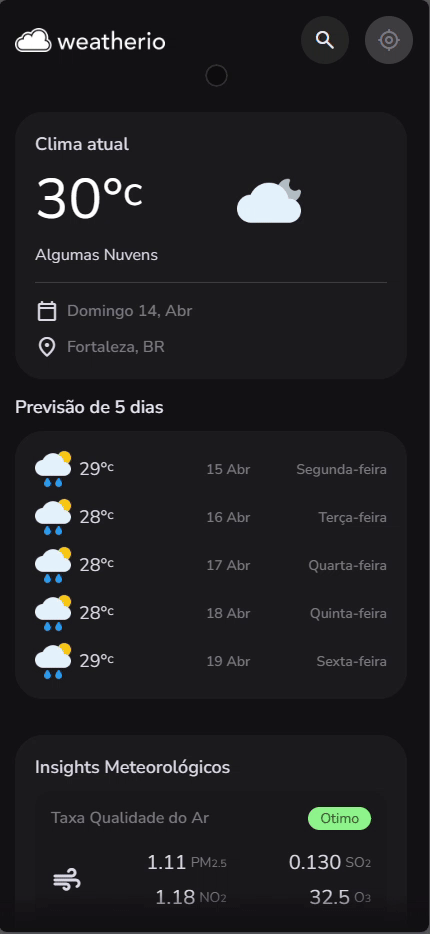
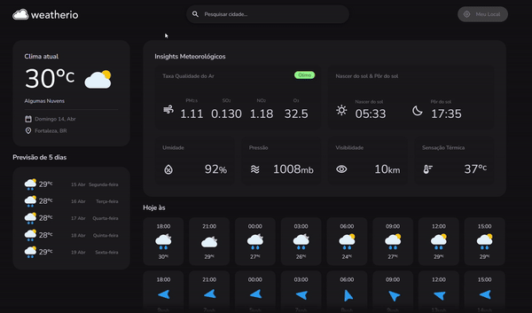

# Weatherio


O **Weatherio** é um site que fornece informações meteorológicas detalhadas para cidades em todo o mundo. Ele foi desenvolvido usando _HTML, CSS e Javascript_, e consome dados de uma API pública, especificamente a OpenWeatherMap. O site é hospedado na plataforma Netlify usando serverless functions.

## Table of Contents

1. [Visão Geral do Projeto](#visão-geral-do-projeto-funcionalidades-principais)
   - [Busca por Cidades](#1-busca-por-cidades)
   - [Dados Detalhados](#2-dados-detalhados)
2. [Tecnologias Utilizadas](#tecnologias-utilizadas-linguagens-e-ferramentas)
3. [Estrutura do Projeto](#estrutura-do-projeto)
4. [Demo](#demo)
5. [Screenshots](#screenshots)
   - [Iphone 14 pro max](#iphone-14-pro-max)
   - [Ipad pro](#ipad-pro)
   - [Mobile](#mobile)
   - [Desk](#desk)
6. [Requisitos para Rodar o Projeto Localmente](#requisitos-para-rodar-o-projeto-localmente)
7. [Rodar o Projeto Localmente](#rodar-o-projeto-localmente)
8. [Autores](#autores)
9. [Licença](#licença)

## Visão Geral do Projeto (Funcionalidades Principais)

### 1. Busca por Cidades:

- Os usuários podem pesquisar cidades pelo nome para obter informações meteorológicas específicas.

### 2. Dados Detalhados:

- **Qualidade do Ar:** Exibe a qualidade do ar com base em índices como PM2.5 e PM10.
- **Direção do Vento:** Mostra a direção e a velocidade do vento.
- **Nascer e Pôr do Sol:** Informa os horários de nascer e pôr do sol.
- **Umidade:** Exibe a umidade relativa do ar.
- **Pressão Atmosférica:** Apresenta a pressão atmosférica em hPa.
- **Visibilidade:** Indica a visibilidade em metros.
- **Sensação Térmica:** Mostra a sensação térmica com base na temperatura e vento.
- **Previsão Hora a Hora:** Exibe a previsão do tempo para as próximas 24 horas, com atualizações a cada 3 horas.
- **Previsão para os Próximos 5 Dias:** Mostra a previsão estendida para os próximos 5 dias.

## Tecnologias Utilizadas (Linguagens e ferramentas)

<table>
    <tr>
      <td align="center">
        <a href="https://www.w3schools.com/html/">
          
          <br />
          <sub>
            <b>HTML</b>
          </sub>
        </a>
      </td>
      <td align="center">
        <a href="https://www.w3schools.com/Css/">
          
          <br />
          <sub>
            <b>CSS</b>
          </sub>
        </a>
      </td>
      <td align="center">
        <a href="https://developer.mozilla.org/pt-BR/docs/Web/JavaScript">
          
          <br />
          <sub>
            <b>Javascript</b>
          </sub>
        </a>
      </td>
    </tr>
</table>
<table border-style="none">
  <tr>
      <td align="center">
        <a href="https://openweathermap.org/">
          
          <br />
          <sub>
            <b>OpenWeathermap</b>
          </sub>
        </a>
      </td>
    <td align="center">
      <a href="https://www.netlify.com/">
        
        <br />
        <sub>
          <b>Netlify</b>
        </sub>
      </a>
    </td>
    <td align="center">
      <a href="https://www.netlify.com/blog/intro-to-serverless-functions/">
        
        <br />
        <sub>
          <b>Serverless</b>
        </sub>
      </a>
    </td>
    <td align="center">
      <a href="https://git-scm.com/">
        <br />
        <sub>
          <b>Git</b>
        </sub>
      </a>
    </td>
    <td align="center">
      <a href="https://github.com/">
        
        <br />
        <sub margin-top="50px;">
          <b>Github</b>
        </sub>
      </a>
    </td>
  </tr>
</table>

## Estrutura do Projeto

The project is organized into multiple files for better code organization and separation of concerns:

- `index.html`: O arquivo HTML principal que contém a interface do usuário.
- `style.css`: O arquivo CSS que define o estilo do aplicativo web.
- `dataWeather.js`: Contém funções para interagir com o serverless/.
- `serverless/`: Contém funções para interagir com a API OpenWeather.
- `module.js`: Contém funções utilitárias relacionadas à conversão e cálculos de dados meteorológicos.
- `app.js`: Contém a lógica principal do aplicativo, incluindo manipulação e renderização de eventos.
- `route.js`: Define as rotas do aplicativo e lida com alterações de hash de URL.

## Demo

[Weatherio](https://weatherio-evandevelop.netlify.app/)

## Screenshots

### Iphone 14 pro max



### Ipad pro



### Mobile



### Desk



## Requisitos para Rodar o Projeto Localmente

### Node.js e npm:

- Verifique se você tem o Node.js instalado. Caso contrário, faça o download e instale a versão mais recente do Node.js.
- O npm (Node Package Manager) é instalado automaticamente com o Node.js.

### Git:

- Certifique-se de ter o Git instalado em sua máquina. Se não tiver, você pode baixá-lo aqui.

### Editor de Texto ou IDE:

- Escolha um editor de texto ou uma IDE (Ambiente de Desenvolvimento Integrado) para trabalhar no código. Alguns exemplos populares incluem o Visual Studio Code, Sublime Text e Atom.

### Navegador Web:

- Você precisará de um navegador web para visualizar o aplicativo localmente. Recomendamos o uso do Google Chrome, Mozilla Firefox ou Microsoft Edge.

### Conta na API OpenWeatherMap:

- O projeto Weatherio consome dados da API OpenWeatherMap. Crie uma conta gratuita em OpenWeatherMap e obtenha uma chave de API (API key).

## Rodar o Projeto Localmente

**Clone o projeto**

```bash
  git clone https://github.com/Evanildo-Silva/weatherio.git
```

**Vá para a pasta do projeto**

```bash
  cd weatherio
```

**Abra o projeto no VSCode**

```bash
  code .
```

**Instale as dependências**

```bash
  npm install # Instala as dependências (se ainda não tiver feito)
```

**Abra com o live server**

```bash
  npm run start # Inicia o servidor com Live Server
```

## Autores

- [@Evanildo-Silva](https://github.com/Evanildo-Silva)

## Licença

- [MIT](https://choosealicense.com/licenses/mit/)
